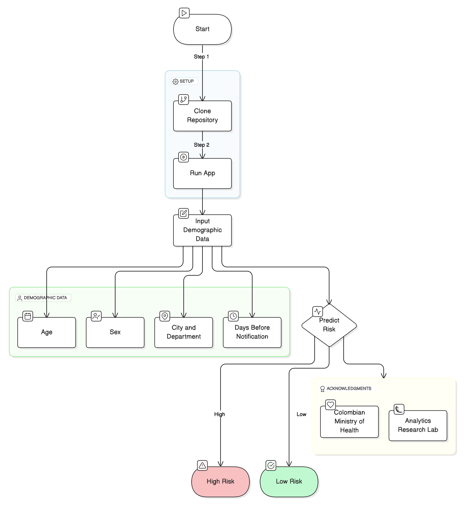

# Prediction of risk of death by COVID19 (2020)

Shiny app to predict the risk of death by COVID-19 based on demographic data. It leverages the classification model SVM trained on public available data from the Colombian Ministry of Health. The app is in Spanish.

Demographic data:
- Age
- Sex
- City and department
- Days before notification of symptoms

How to run the app:
1. Clone the repository
2. You can run the app by running `shiny::runApp("app")` in R.

## Acknowledgments
- Data provided by the Colombian Ministry of Health.
- Model trained togethr with the Analytics Research Lab of the Universidad del Norte.

